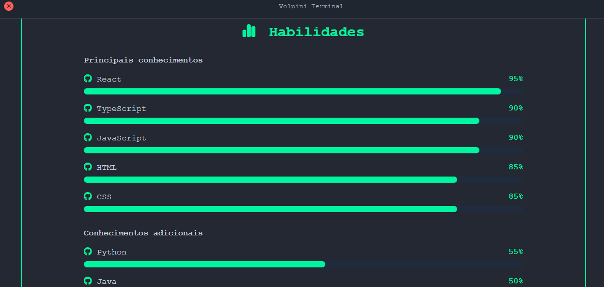

# Terminal Portfolio Volpini OS

Portfólio pessoal com interface inspirada em um terminal de computador. O visitante navega pelo conteúdo digitando comandos, como em um sistema operacional de linha de comando.

O objetivo é apresentar informações profissionais (sobre mim, experiencia, projetos, currículo e contato) de uma forma diferente dos portfólios tradicionais, mantendo a navegação simples e acessível.

---

## Site publicado

**https://rafaelvolpini-portfolio.netlify.app**

Hospedagem: **Netlify** (deploy contínuo a partir do repositório no GitHub — cada `push` na branch principal gera uma nova publicação automaticamente).

---

## Tecnologias utilizadas

| Tecnologia | Uso no projeto |
|---|---|
| **HTML5** | Estrutura semântica e acessível das seções do sistema. |
| **CSS3** | Layout responsivo, tema de terminal, animações, foco visível e suporte a `prefers-reduced-motion`. |
| **JavaScript (Vanilla / ES6+)** | Interpretador de comandos do terminal, navegação entre seções, troca de idioma e validação do formulário de contato. Sem frameworks. |
| **PDF.js** | Visualizador de currículo em PDF embutido na própria página (navegação de páginas, zoom, download e abertura de outro PDF local). |
| **Font Awesome 6** | Ícones da interface e dos links sociais. |
| **live-server** (npm) | Servidor local com recarregamento automático durante o desenvolvimento. |
| **Git + GitHub** | Versionamento e origem do deploy. |
| **Netlify** | Hospedagem estática e publicação contínua. |

---

## Funcionalidades

- Interface completa inspirada em terminal, com prompt, cursor e histórico de saída.
- Navegação por comandos digitados (com `Enter` para executar).
- Menu de opções navegável por teclado, além dos comandos.
- Exibição dinâmica das seções sem recarregar a página.
- Comando de ajuda listando todos os comandos disponíveis.
- Comando `clear` para limpar a saída e voltar ao estado inicial.
- **Currículo em dois formatos:**
  - **Currículo PDF** — abre o visualizador PDF.js com o arquivo `CV Rafael Nagem Volpini-5.pdf`.
  - **Currículo no terminal** — exibe experiências, formação e informações em texto, dentro do próprio terminal.
- Formulário de contato com validação de nome, e-mail e mensagem.
- Links para GitHub, LinkedIn e WhatsApp.
- Suporte a mais de um idioma na interface.
- Design responsivo para celular e tablet.
- Conteúdo centralizado e personalizável em `portfolio/js/data.js`.

---

## Comandos disponíveis

| Comando | Descrição |
|---|---|
| `/sobre` | Informações sobre o desenvolvedor, trajetória e formação. |
| `/habilidades` | Tecnologias, ferramentas e habilidades técnicas. |
| `/projetos` | Lista dos projetos desenvolvidos, com descrição, tecnologias e links. |
| `/curriculo` | Currículo — permite escolher entre **PDF** e **terminal**. |
| `/contato` | Formas de contato e redes profissionais. |
| `/ajuda` | Mostra todos os comandos disponíveis. |
| `clear` | Limpa a tela e retorna ao estado inicial. |

Também é possível navegar pelo menu inicial usando as setas do teclado e `Enter`, sem digitar nada.

---

## Instruções de uso

1. Acesse **https://rafaelvolpini-portfolio.netlify.app**.
2. Na tela inicial, digite um comando (por exemplo `/sobre`) e pressione `Enter`, ou selecione uma opção do menu com as setas e `Enter`.
3. Digite `/ajuda` a qualquer momento para ver a lista completa de comandos.
4. Em `/curriculo`, escolha:
   - **Currículo PDF** → abre o visualizador com controles de página, zoom, download e o botão **Abrir PDF** para carregar outro arquivo local;
   - **Currículo no terminal** → exibe o conteúdo em texto na própria tela.
5. Use `clear` para limpar a saída e recomeçar.

---

## Instruções de desenvolvimento

Pré-requisitos: **Node.js 18+** e **npm** instalados.

```bash
# 1. Clonar o repositório
git clone https://github.com/<seu-usuario>/<seu-repositorio>.git
cd <seu-repositorio>/portfolio

# 2. Instalar as dependências
npm install

# 3. Iniciar o servidor de desenvolvimento
npm run dev
```

Depois abra no navegador o endereço exibido pelo `live-server` (normalmente `http://127.0.0.1:8080`). As alterações em HTML, CSS e JS recarregam a página automaticamente.

### Personalizando o conteúdo

Todo o conteúdo textual do sistema fica em **`portfolio/js/data.js`**. Para adaptar o portfólio, edite esse arquivo:

- dados de **Sobre mim**;
- lista de **habilidades**;
- lista de **projetos** (título, descrição, tecnologias, links e imagem/GIF);
- itens do **currículo** exibido no terminal;
- **contatos** e redes sociais.

Para trocar o currículo em PDF, substitua o arquivo `portfolio/CV Rafael Nagem Volpini-5.pdf` e atualize o caminho referenciado em `data.js`.

O formulário de contato usa `mailto:volpini767@gmail.com` e abre o aplicativo de e-mail padrão do visitante. Para receber os envios direto no servidor, basta trocar esse fluxo por um serviço como Formspree ou por uma API própria.

## Preview

### Tela inicial


### Sistema em execução


Navegação entre as seções digitando os comandos no terminal.

### Seção `/sobre`


### Seção `/habilidades`



Exibe as principais habilidades e os conhecimentos adicionais em barras de progresso.

### Seção `/projetos`


### Seção `/experiências`


### Seção `/curriculo` — Currículo PDF


Visualizador PDF.js com navegação de páginas, zoom e download.

### Seção `/curriculo` — Currículo no terminal


### Seção `/contato`


## Estrutura do projeto

```text
portfolio/
│
├── index.html
├── package.json
├── README.md
├── CV Rafael Nagem Volpini-5.pdf
│
├── assets/
│   ├── images/
│   │   ├── tela-inicial.png
│   │   ├── sobre.png
│   │   ├── habilidades.png
│   │   ├── projetos.png
│   │   ├── curriculo-terminal.png
│   │   ├── contato.png
│   │   └── mobile.png
│   │
│   └── gifs/
│       ├── navegacao-terminal.gif
│       └── curriculo-pdf.gif
│
├── css/
│   └── style.css
│
└── js/
    ├── script.js
    └── data.js
```

## Autor

**Rafael Nagem Volpini**

- Site: https://rafaelvolpini-portfolio.netlify.app
- E-mail: volpini767@gmail.com
- GitHub: https://github.com/<seu-usuario>
- LinkedIn: https://www.linkedin.com/in/<seu-perfil>

> Projeto acadêmico individual. A estrutura de front-end (layout, navegação e componentes) é compartilhada com o grupo, mas todo o conteúdo e este repositório são individuais.
